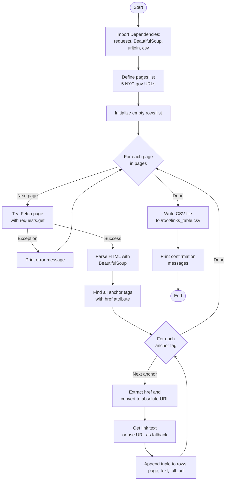

```mermaid
flowchart TD
    Start([Start]) --> Import[Import Dependencies:<br/>requests, BeautifulSoup,<br/>urljoin, csv]
    Import --> DefinePages[Define pages list<br/>5 NYC.gov URLs]
    DefinePages --> InitRows[Initialize empty rows list]
    InitRows --> LoopStart{For each page<br/>in pages}
    
    LoopStart -->|Next page| TryFetch[Try: Fetch page<br/>with requests.get]
    TryFetch -->|Exception| PrintError[Print error message]
    PrintError --> LoopStart
    
    TryFetch -->|Success| ParseHTML[Parse HTML with<br/>BeautifulSoup]
    ParseHTML --> FindAnchors[Find all anchor tags<br/>with href attribute]
    FindAnchors --> InnerLoop{For each<br/>anchor tag}
    
    InnerLoop -->|Next anchor| ExtractHref[Extract href and<br/>convert to absolute URL]
    ExtractHref --> GetText[Get link text<br/>or use URL as fallback]
    GetText --> AppendRow[Append tuple to rows:<br/>page, text, full_url]
    AppendRow --> InnerLoop
    
    InnerLoop -->|Done| LoopStart
    LoopStart -->|Done| WriteCSV[Write CSV file<br/>to /root/links_table.csv]
    WriteCSV --> PrintConfirm[Print confirmation<br/>messages]
    PrintConfirm --> End([End])
```