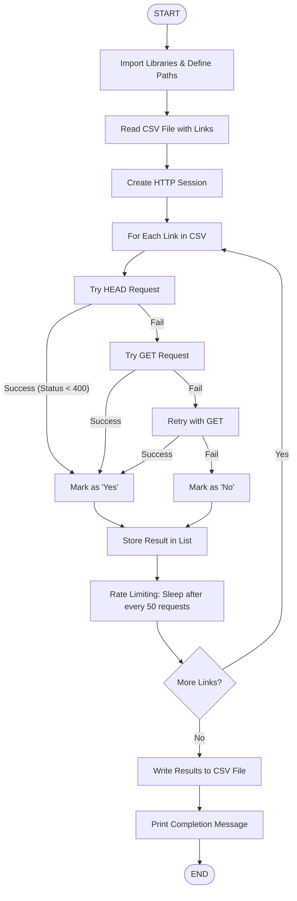

```mermaid
    flowchart TD
    Start([START]) --> Import["Import Libraries & Define Paths"]
    Import --> ReadCSV["Read CSV File with Links"]
    ReadCSV --> CreateSession["Create HTTP Session"]
    CreateSession --> ForEach["For Each Link in CSV"]
    ForEach --> TryHEAD["Try HEAD Request"]
    TryHEAD -->|"Success (Status < 400)"| MarkYes1["Mark as 'Yes'"]
    TryHEAD -->|Fail| TryGET["Try GET Request"]
    TryGET -->|Success| MarkYes1
    TryGET -->|Fail| RetryGET["Retry with GET"]
    RetryGET -->|Success| MarkYes1
    RetryGET -->|Fail| MarkNo["Mark as 'No'"]
    MarkYes1 --> Store["Store Result in List"]
    MarkNo --> Store
    Store --> RateLimit["Rate Limiting: Sleep after every 50 requests"]
    RateLimit --> MoreLinks{"More Links?"}
    MoreLinks -->|Yes| ForEach
    MoreLinks -->|No| WriteCSV["Write Results to CSV File"]
    WriteCSV --> PrintMsg["Print Completion Message"]
    PrintMsg --> End([END])
```