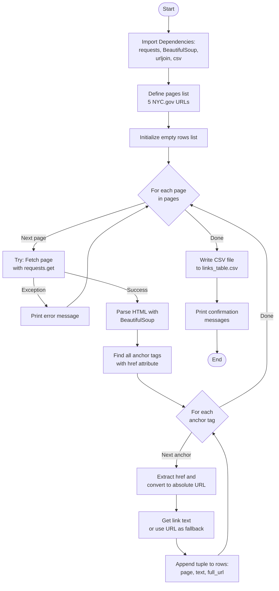
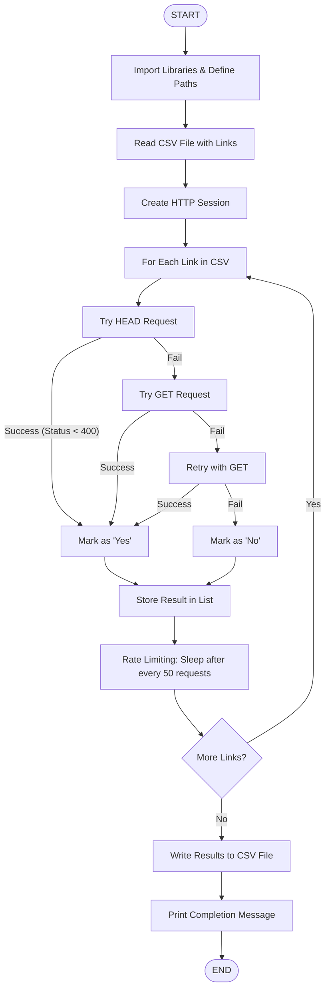

# 🏙️ Queens Community Board 2 - Link Verification Tool

Welcome to the Queens Community Board 2 repository! This project helps CB2 members ensure that all links on the Queens CB2 website are active and working correctly.

---

## 📋 About This Project

The **Link Verification Tool** is a community-driven project designed to:
- ✅ Automatically scan the Queens CB2 website for all links
- ✅ Verify that each link is active and accessible
- ✅ Create a report of working and broken links
- ✅ Upload verified data to a central server for tracking

This tool helps **CB2 members and constituents** maintain the quality and reliability of the community board's web presence.

---

## 🎯 How It Works

The tool follows a **3-step pipeline**:

### Step 1️⃣: Link Scraper
Automatically discovers all links on the Queens CB2 website pages and saves them to a CSV file.

**Input**: Queens CB2 website URLs  
**Output**: `links_table.csv` (list of all links found)

### Step 2️⃣: Link Verifier
Tests each discovered link to check if it's still active and accessible.

**Input**: `links_table.csv`  
**Output**: `links_table_with_status.csv` (links with status: ✅ Active or ❌ Broken)

### Step 3️⃣: Data Uploader
Sends the verified link data to a central server for storage and tracking.

**Input**: `links_table_with_status.csv`  
**Output**: HTTP confirmation to server

---

## 📊 Process Flow

### Step 1: Link Scraper


### Step 2: Link Verifier


---

## 🚀 Quick Start Guide

### Prerequisites
- Python 3.7+
- Python packages listed in `requirements.txt`

### Installation

1. **Clone this repository**
   ```bash
   git clone https://github.com/valdezax2/queens-cb2.git
   cd queens-cb2
   ```

2. **Install required packages**
   ```bash
   pip install -r requirements.txt
   ```

   Optional (for running notebooks):
   ```bash
   pip install notebook
   ```

3. **Navigate to the tool directory**
   ```bash
   cd homepage/link_grabber
   ```

### Running the Tool

#### Option 1: Full Automated Run
```bash
./test_uploader.sh
```
This runs all 3 steps with automatic testing.

#### Option 2: Step-by-Step with Jupyter Notebooks
1. Open `01. all_link_grabber.ipynb` → Run all cells
2. Open `02. link_verify.ipynb` → Run all cells
3. Open `03_csv_uploader.ipynb` → Run all cells

#### Option 3: Individual Python Scripts
```bash
# Step 1: Scrape links
jupyter nbconvert --to script "01. all_link_grabber.ipynb"
python3 "01. all_link_grabber.py"

# Step 2: Verify links
jupyter nbconvert --to script "02. link_verify.ipynb"
python3 "02. link_verify.py"

# Step 3: Upload data (optional-advanced)
# Don't use this script unless you have programming experience
# You will need to edit the file to secure the server/client communication
python3 03_csv_uploader.py


```

---

## 📁 Project Structure

```
queens-cb2/
├── README.md (root monorepo overview)
├── requirements.txt                # Python dependencies
├── LICENSE
└── homepage/link_grabber/
    ├── 01. all_link_grabber.ipynb       # Step 1: Scrape links
    ├── 02. link_verify.ipynb            # Step 2: Verify links
    ├── 03_csv_uploader.py               # Step 3: Upload data (Python)
    ├── 03_csv_uploader.ipynb            # Step 3: Upload data (Notebook)
    ├── test_uploader.sh                 # Automated test harness
    ├── README_UPLOADER.md               # Detailed documentation
    ├── START_HERE.md                    # Quick reference
    ├── COMPLETION_REPORT.md             # Technical summary
    ├── links_table.csv                  # Output: All links
    ├── links_table_with_status.csv      # Output: Links with status
    └── flow_chart/
        ├── 01.1 flow-chart.md
        └── 02.1 flow-chart.md
```

---

## 📊 Output Files

After running the tool, you'll have:

1. **`links_table.csv`**
   - Contains all discovered links from the Queens CB2 website
   - Columns: Source Page, Link Text, Link URL

2. **`links_table_with_status.csv`**
   - All links with their status (Active ✅ or Broken ❌)
   - Columns: Source Page, Link Text, Link URL, Alive (Yes/No)

---

## 🤝 Contributing

We welcome contributions from Queens CB2 members, constituents, and community volunteers! Whether you're a developer, web designer, or just someone who cares about the community board's web presence, you can help.

### Ways to Contribute

1. **Found a Bug?**
   - Report it by opening an Issue
   - Or submit a Pull Request with a fix

2. **Have an Improvement?**
   - Add new features to make the tool better
   - Suggest improvements to the documentation
   - Optimize performance or add error handling

3. **Want to Help Verify Links?**
   - Run the tool and check the results
   - Verify that broken links are actually broken
   - Help update the Queens CB2 website URLs to fix links

### How to Submit a Pull Request

1. **Fork the repository**
   ```bash
   Click "Fork" button on GitHub
   ```

2. **Create a new branch**
   ```bash
   git checkout -b feature/your-feature-name
   ```

3. **Make your changes**
   - Edit the files you want to improve
   - Test your changes thoroughly
   - Add comments to explain your code

4. **Commit your changes**
   ```bash
   git add .
   git commit -m "Brief description of what you changed"
   ```

5. **Push to your fork**
   ```bash
   git push origin feature/your-feature-name
   ```

6. **Open a Pull Request**
   - Go to the original repository
   - Click "New Pull Request"
   - Select your branch and describe your changes
   - Click "Create Pull Request"

7. **Wait for Review**
   - A maintainer will review your changes
   - Make any requested updates
   - Once approved, your code will be merged!

### Pull Request Guidelines

Please follow these guidelines when submitting a PR:

✅ **Do**:
- Write clear commit messages
- Test your changes before submitting
- Update documentation if needed
- Reference any related issues

❌ **Don't**:
- Submit large changes without creating an Issue first
- Change unrelated code in your PR
- Add unnecessary dependencies

---

## 🐛 Reporting Issues

Found a problem? Help us fix it!

1. **Check if the issue already exists**
   - Search through existing Issues first

2. **Create a new Issue**
   - Click "Issues" tab
   - Click "New Issue"
   - Describe the problem clearly:
     - What are you trying to do?
     - What happened instead?
     - What did you expect to happen?
     - What step broke?

3. **Include helpful details**
   - Python version: `python --version`
   - Error messages (copy the full text)
   - Screenshot if relevant
   - Steps to reproduce the issue

---

## ❓ FAQ

**Q: Do I need to be a programmer to use this?**  
A: No! You can run it using the automated test harness or Jupyter notebooks without writing any code.

**Q: How often should I run this tool?**  
A: We recommend running it monthly to catch broken links early. You can automate it with a cron job.

**Q: What if a link is temporarily down?**  
A: The tool marks it as broken. Check again later or investigate manually if it's an important link.

**Q: Can I modify the URLs being scanned?**  
A: Yes! Edit the pages list in `01. all_link_grabber.ipynb` to add or remove URLs.

**Q: How do I report a broken link on the website?**  
A: Check `links_table_with_status.csv` for broken links and submit them as an Issue on this repository.

**Q: Can this tool work with other websites?**  
A: Yes! Modify the `pages` list in Step 1 to scan different websites.

---

## 📞 Support & Community

- **Questions?** Open an Issue on GitHub
- **Want to contribute?** See the Contributing section above
- **Found a bug?** Please report it with as much detail as possible
- **Have ideas?** We'd love to hear them! Create an Issue to discuss

---

## 📄 License

This project is licensed under the Apache-2.0 License - see the [LICENSE](../../LICENSE) file for details.

---

## 👥 Contributors

A big thank you to all CB2 members and community volunteers who have contributed to this project!

Want to see your name here? Contribute to the project!


---

**Last Updated**: November 2, 2025

🙏 Thank you for supporting Queens Community Board 2!
